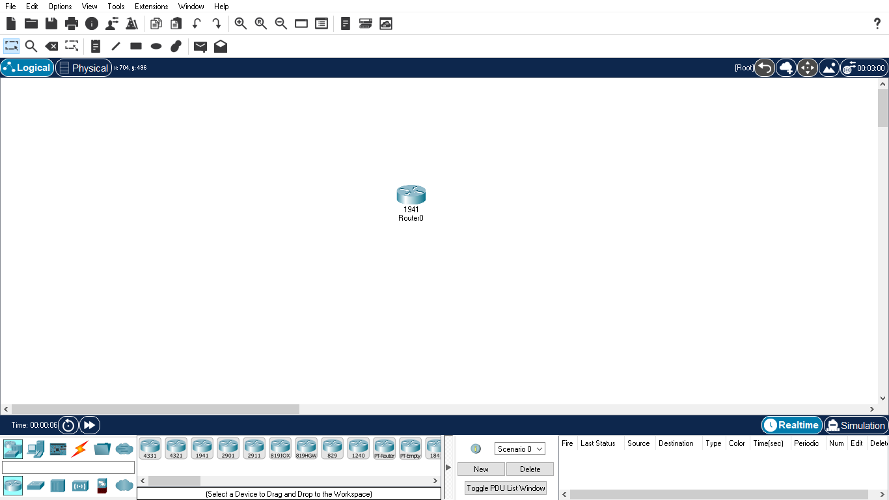

# Networking and Communication Lab Task

## Tool used: [Packet Tracer](https://www.netacad.com/courses/packet-tracer)

 

## All lab task files

 

### [Lab 4 - Configuring Router Host Name](Lab4-ConfiguringRouterHostName.pkt)

 

 
 

### [Lab 5 - Intro to Router Commands](Lab5-IntroToRouterCommands.pkt)

 

 
 

### [Lab 6 - Connecting Devices](Lab6-ConnectingDevices.pkt)

 

 
 

### [Lab 7 - Network Topologies - I](Lab7-NetworkTopologies-I.pkt)

 

 
 

### [Lab 8 - Network Topologies - II](Lab8-NetworkTopologies-II.pkt)

 

 
 

### [Lab 9 - Router Configuration](Lab9-RouterConfiguration.pkt)

 

 
 

### [Lab 10 - Email & DNS Server Configuration](Lab10-Email&DNSserverConfiguration.pkt)

 

 
 

### [Lab 11 - DHCP Server Configuration](Lab11-DHCPserverConfiguration.pkt)

 

 
 

### [Lab 12 - Configuring DHCP Server on Router](Lab12-ConfiguringDHCPServerOnRouter.pkt)

 

 
 

### [Lab 13 - Configuring Router using Commands](Lab13-ConfiguringRouterUsingCommands.pkt)

 

 
 

### [Lab 14 - Configuring Router Console Port](Lab14-ConfiguringRouterConsolePort.pkt)

 

 
 

### [Lab 15 - Configure Network Printer using two Router Enviroment](Lab15-ConfigureNetworkPrinterUsingTwoRouterEnviroment.pkt)

 

 
 

### [Lab 16 - Switch Bacis Commands - I](Lab16-SwitchBacisCommands-I.pkt)

 

 
 

### [Lab 17 - Switch Bacis Commands - II](Lab17-SwitchBacisCommands-II.pkt)

 

 
 

### [Lab 18 - VLAN(Virtual LAN) - I](<Lab18-VLAN(VirtualLAN)-I.pkt>)

 

 
 

### [Lab 19 - VLAN(Virtual LAN) - II](<Lab19-VLAN(VirtualLAN)-II.pkt>)

 

 
 

### [Lab 21 - VLSM(Variable Length Subnet Mask)](<Lab21-VLSM(VariableLengthSubnetMask).pkt>)

 

 
 

### [Lab 22 - RIP(Routing Information Protocol)](<Lab22-RIP(RoutingInformationProtocol).pkt>)

 

 
 

### [Lab 24 - Configure EIGRP(Enhanced Interior Gateway Routing Protocol)](<Lab24-ConfigureEIGRP(EnhancedInteriorGatewayRoutingProtocol).pkt>)

 

